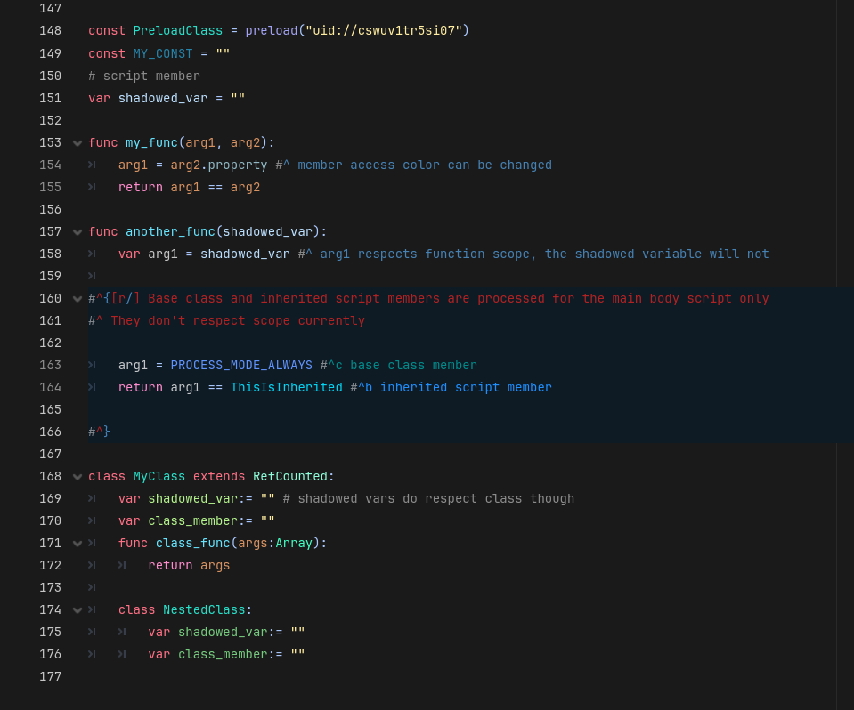

### Version 1.0.0
Compatible with Godot 4.6+

I've written a GDScript parser that I am using for a code completion plugin, so I've updated this plugin to use some of the extended features that can provide.

Almost all of the following can be enabled/disabled in EditorSettings and all colors are adjustable.
#### Features
 - Highlighting const members when declared in either PascalCase or CONSTANT_CASE
 - Function argument highlighting, arguments of functions will be highlighted within their functions
 - Inner class member highlighting, all can be the same, or nested classes can have their hue changed based on nest depth
 - Members are now separated from inherited script members and base class members (default is all the same color)
 - Tags can be defined to highlight a specific word
 - Comments can be highlighted different colors by using "#^", this can also be used to change the background of the script editor to a different color in a range of lines

#### Setup
Download the zip in "releases" and extract the contents into addons.

When a syntax highlighter is added to the script editor, it isn't added to already open scripts. The easiest thing to do is just restart the editor so it can be added to the open scripts.

In EditorSettings there is a toggle that will automatically set any GDScript file to the SyntaxPlus highlighter. This is off by default, so you may want to set that.

